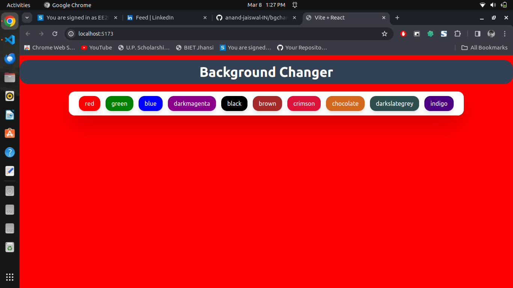

# Simple React Background Changer App

This is a simple React app that allows users to change the background color by clicking on different colored buttons. The project is built using Vite, a fast build tool for modern web development.

## Screenshots




## Features

- Change the background color by clicking on different colored buttons.
- Built with Vite for fast development and performance.
- Uses React for building user interfaces.

## Getting Started

To get started with this project, follow these steps:

1. Clone the repository:

```bash
git clone https://github.com/your-username/simple-react-background-changer.git
```

2. Navigate to the project directory:

```bash
cd simple-react-background-changer
```

3. Install dependencies:

```bash
npm install
```

4. Start the development server:

```bash
npm run dev
```

5. Open your browser and visit http://localhost:3000 to view the app.

## Usage

- Click on the colored buttons to change the background color of the app.

## Technologies Used

- React
- Vite
- Tailwind

## Folder Structure

```
simple-react-background-changer/
│
├── index.html
│   ...
│
├── src/
│   ├── main.jsx
│   ├── Home.jsx
│   ├── App.jsx
|   ├── main.css
│
├── .gitignore
├── package.json
├── README.md
└── ...

```

## Contributing

Contributions are welcome! Feel free to open an issue or submit a pull request.
